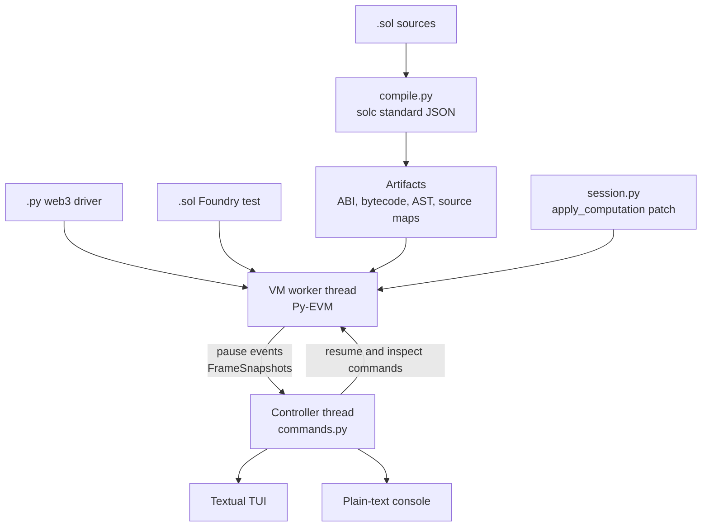

# sevm: gdb for Solidity and the EVM

> **Note**: sevm is alpha software. Commands and debugger behavior may change.

> **Note**: Source-level stepping depends on unoptimized, non-via-IR builds. Optimized
> code degrades Solidity source maps and makes stepping unreliable.

sevm extends the Foundry test workflow with a live, gdb-style debugger for Solidity and
the EVM. It runs `.t.sol` files on Py-EVM and pauses inside a transaction before the call
frame unwinds, with uncommitted state, memory, the stack and locals all still readable.

<!-- demo: record the TUI (vhs/asciinema) and embed here -->

```text
  Bank._credit(address,uint256)  Bank.sol:46  gas 271,443/300,000  depth 1  pc 0x3f2  SSTORE
 +-SOURCE--------------------------------------+-CALL STACK-----------------------+
 |  44     function _credit(address who, ...   | -> #0 Bank._credit   Bank.sol:46 |
 |  45         uint256 fee = _fee(amount);     |    #1 Bank.deposit   Bank.sol:52 |
 |> 46         balances[who] += amount - fee;  |    #2 Bank at pc 0x380           |
 |  47         totalDeposits += amount - fee;  +-VARIABLES------------------------+
 |  48         history.push(amount);           | who     address = 0x0278bdd7...  |
 |  49     }                                   | amount  uint256 = 2 ether        |
 +-DISASSEMBLY-----+-STACK----------+-MEMORY---+ fee     uint256 = 0.005 ether    |
 |  0x3f0 PUSH1 00 | 0  0x1bc16d67e | 0x40 0080+-STORAGE--------------------------+
 |> 0x3f2 SSTORE   | 1  0x0278bdd78 | 0x60 0000| 0+0  owner         = 0xf2e246bb..|
 |  0x3f3 PUSH2 01 | 2  0x000000003 | 0x80 0001| 1+0  totalDeposits = 0           |
 +-----------------+----------------+----------+----------------------------------+
 (sevm) p amount - fee
 $1 = 1995000000000000000 (1.995000 ether)  (uint256)
```

## Table of Contents

- [Features](#features)
- [Quick Start](#quick-start)
- [Example: Debugging a Foundry Test](#example-debugging-a-foundry-test)
- [Example: Debugging a web3 Script](#example-debugging-a-web3-script)
- [Architecture](#architecture)
- [Use Cases](#use-cases)
- [Foundry Compatibility](#foundry-compatibility)
- [Requirements](#requirements)
- [Development](#development)
- [License](#license)

Reference guides:

| Guide | What is in it |
|---|---|
| [docs/commands.md](docs/commands.md) | every command, breakpoints and watchpoints, convenience variables |
| [docs/expressions.md](docs/expressions.md) | evaluating Solidity, reading and writing local variables |
| [docs/assembly.md](docs/assembly.md) | Yul builtins at the prompt, what is refused and why |
| [docs/foundry.md](docs/foundry.md) | projects, library install, the build cache, cheatcodes |

The running debugger documents itself too: `help`, `help assembly`, `help cheatcodes` and
`help foundry` are generated from the registries at import time, so they cannot drift from
what is implemented.

## Features

- **Stop inside a running transaction**, with the EVM frame and uncommitted state still
  live.
- **Move between the Solidity and EVM views** at the same execution point. Source, opcodes,
  stack, memory, storage, locals, calldata, gas and the call stack.
- **Step by Solidity line or by opcode**, set conditional breakpoints, and watch storage or
  memory for reads and writes.
- **Expressions are real Solidity.** `p balances[who] + 100 ether` is compiled against the
  paused contract and run on a throwaway snapshot, so it cannot disturb the run.
- **Mutate execution mid-transaction.** Storage through Solidity, a local's stack slot, a
  stack operand before its opcode consumes it, memory, gas, the program counter.
- **Run Yul builtins against the paused frame** through Py-EVM's own opcode
  implementations.
- **Foundry cheatcodes against live state**, including pranks, `deal`, `store`, `load`,
  block environment changes, signing helpers and the `vm.assert*` family.
- **Foundry projects work untouched.** `foundry.toml`, `remappings.txt` and `lib/` are read
  as they are, and missing libraries are cloned and remapped without the `forge` binary.
- **Two frontends.** A Textual fullscreen interface, or plain text with `--console`.

## Quick Start

Install sevm from a checkout with [uv](https://docs.astral.sh/uv/):

```bash
uv tool install .
```

Run a Foundry test in the fullscreen debugger, narrow the run to one test in the
plain-text frontend, or inspect the compiled project:

```bash
sevm run test/Counter.t.sol
sevm run --console -m testDeposit test/Vault.t.sol
sevm compile .
```

Options go **before** the target. `sevm run` also accepts an unchanged web3.py driver, and
everything after a `.py` target is forwarded to that script:

```bash
sevm run --contracts tests/contracts examples/debug_bank.py
```

Run `sevm run --help` and `sevm compile --help` for the complete option list.

## Example: Debugging a Foundry Test

Point `sevm run` at a `.sol` test. A lone test can import forge-std and other libraries
without an existing Foundry project:

```solidity
// /tmp/scratch/Vault.t.sol
import {Test} from "forge-std/Test.sol";
import {IERC20} from "@openzeppelin/contracts/token/ERC20/IERC20.sol";

contract VaultTest is Test {
    address alice = address(0xA11CE);

    function testDeal() public {
        vm.deal(alice, 3 ether);
        assertEq(alice.balance, 3 ether);
    }
}
```

```console
$ sevm run --console -y /tmp/scratch/Vault.t.sol
standalone test at /tmp/scratch; compiling ...
installing forge-std from https://github.com/foundry-rs/forge-std @ v1.16.2
installing @openzeppelin/contracts from https://github.com/OpenZeppelin/openzeppelin-contracts @ v5.7.0
wrote 2 remapping(s) to remappings.txt
wrote 25 artifact(s) to out/sevm
debugging 1 test(s): VaultTest.testDeal
Breakpoint 1, VaultTest.testDeal() at Vault.t.sol:11
  11          vm.deal(alice, 3 ether);
```

Break inside the contract under test, walk the frames, then change the world:

```console
(sevm) b Bank.deposit
Breakpoint 2 at Bank.deposit (line 68)
(sevm) c
Breakpoint 2, Bank.deposit() at Test.t.sol:68
  68          _credit(msg.sender, msg.value);
(sevm) bt
-> #0 Bank.deposit() at Test.t.sol:68
   #1 Bank at pc 0x380
   #2 DebugTest.testDeposit() at Test.t.sol:18
   #3 DebugTest at pc 0x193
(sevm) p msg.value
$1 = 1000000000000000000 (1 ether)  (uint256)
(sevm) vm.warp(12345)
vm.warp -> ok
(sevm) p block.timestamp
$2 = 12345  (uint256)
```

A failed assertion stops the debugger where it broke, with the comparison decoded:

```console
(sevm) c
Stopped on error: reverted: "assertion failed: 100 != 120"
  StdAssertions.assertEq(uint256, uint256) at lib/forge-std/src/StdAssertions.sol:121
 121              vm.assertEq(left, right);
(sevm) up
#1  FailTest.testBalance() at Fail.t.sol:9
```

Each test gets a fresh deploy, `setUp()`, and test call. With no `-m/--match` filter,
`continue` runs to the next test body. Read [Foundry compatibility](#foundry-compatibility)
for supported workflows and cheatcodes.

## Example: Debugging a web3 Script

Your script needs no changes. It drives web3.py against an in-process Py-EVM chain while
sevm compiles the contracts, patches Py-EVM, and stops when execution enters recognized
bytecode:

```console
$ sevm run --console --contracts tests/contracts examples/debug_bank.py
compiling tests/contracts ...
cache hit (3 sources)
4 contract(s): Bank, Callee, Locals, Vault
Bank.constructor(string) at Bank.sol:31
  31      constructor(string memory _name) payable {
(sevm) b _credit
Breakpoint 1 at Bank._credit (line 45)
(sevm) c
Breakpoint 1, Bank._credit(address, uint256) at Bank.sol:45
  45          uint256 fee = _fee(amount);
(sevm) info locals
  who            address            = 0x0278bdd7808aa64dc93c361ae55fc52cf1a918cf (param)
  amount         uint256            = 2000000000000000000 (2 ether) (param)
  fee            uint256            = <unavailable>  this instruction allocates it;
                                      step once to see it
(sevm) n
Bank._credit(address, uint256) at Bank.sol:46
  46          balances[who] += amount - fee;
(sevm) p amount - fee
$1 = 1995000000000000000 (1.995000 ether)  (uint256)
```

The first stop is usually the constructor. Skip past it with startup commands, which run
before the prompt opens:

```bash
sevm run -x 'b _credit' -x c --contracts tests/contracts examples/debug_bank.py
```

## Architecture



sevm monkeypatches `BaseComputation.apply_computation`, reimplementing Py-EVM's opcode loop
with a blocking hook in the middle of it. The debugged program runs on a worker thread and
the controller drives it over two queues, with the threads strictly alternating, so exactly
one is ever runnable.

Only the VM thread touches Py-EVM objects. The controller works from immutable
`FrameSnapshot`s and asks for anything else through an inspect command that the VM thread
services while parked in the hook. Nested calls need no special handling because `CALL`
re-enters the patched function, and speculative execution is safe because
`state.snapshot()` and `state.revert()` are real journal checkpoints.

Everything above the opcode loop comes from the compiler rather than from guesswork. Line
numbers, internal calls, local variables and storage layout are all recovered from solc's
own output, which is why debug builds keep the optimizer off.

## Use Cases

- Stop a failing Foundry test before its frame unwinds, then inspect the revert and state.
- Attach to an unchanged web3.py driver and debug deployment or transaction execution.
- Compare decoded Solidity values with raw stack, memory, storage, and calldata.
- Rewrite an operand or lower the remaining gas to reproduce a boundary condition at one
  instruction.
- Exercise a live frame with Solidity calls, Foundry cheatcodes, or Yul builtins.

## Foundry Compatibility

`sevm run` dispatches by extension. A `.py` argument attaches to a web3 driver, a `.sol`
argument compiles and runs a Foundry test. It honors `foundry.toml`, `remappings.txt`,
installed libraries, the configured solc version, and `evm_version`. A standalone `.t.sol`
file can create a minimal project and install missing imports after one prompt. `-y`
accepts the write and `--no-install` keeps the run disk-only.

The test runner isolates each test with a fresh deploy and `setUp()`. The cheatcode engine
implements state and environment mutations, pranks, signing helpers, console output, and
the 116 `vm.assert*` overloads used by forge-std. It does not yet support expectations,
mocking, FFI, forks, or fuzz and invariant argument generation.

Compilation uses a per-unit cache and writes forge-shaped artifacts under `out/sevm/`
without overwriting forge's optimizer-enabled output. An edit recompiles the file and its
importers, not the project:

```console
$ time sevm compile .        # first run
wrote 26 artifact(s) to out/sevm
real  1.44

$ time sevm compile .        # unchanged
cache hit (20 sources)
real  0.51

$ time sevm compile .        # after editing one test
recompiled 1 of 20 sources
real  0.98
```

Read the [Foundry tests, dependencies, cache, and cheatcode reference](docs/foundry.md) for
details.

## Requirements

Debug builds compile with the optimizer **off** and via-IR **off**. sevm warns if you
override that, because optimized codegen degrades source maps and makes stepping
unreliable.

Transactions do **not** need an explicit `gas=`. `eth_estimateGas` binary-searches the
limit by running the transaction repeatedly, so its early probes fail out-of-gas by
design. sevm suspends the hook during those probes and reports how many it skipped in
`info frame`.

`git` must be on `PATH`, because sevm clones missing libraries itself and never shells out
to `forge`. The first run for a library needs the network, and later runs reuse the clone
under `lib/`. py-solc-x downloads solc on demand into `~/.solcx`, using the pragma-selected
version or the `foundry.toml` pin.

Verified with web3 7.16.0, py-evm 0.12.1b1, eth-tester 0.13.0b1, py-solc-x 2.0.5, solc
0.8.28, git 2.x, forge-std 1.16.2, Textual 8.2.8, and CPython 3.12. Python 3.10 or newer
is required.

## Development

Set up an editable development environment and install the command from the checkout:

```bash
uv sync
uv run sevm --help
uv tool install .
```

Run the local and network test suites:

```bash
uv run pytest -q                                   # 345 tests, no network
SEVM_NETWORK_TESTS=1 uv run pytest -q -m network   # 4 more, real forge-std and npm
```

The default run builds a forge-std fixture in `tmp_path`, so it needs no network. The
network tests install the real forge-std and OpenZeppelin repositories, and one of them
fails if forge-std declares an assertion sevm does not implement.

Format, lint, type-check, and build the distribution:

```bash
uv run ruff format src tests examples
uv run ruff check src tests examples
uv run mypy src
uv build
```

## License

sevm is available under the [MIT License](LICENSE).
