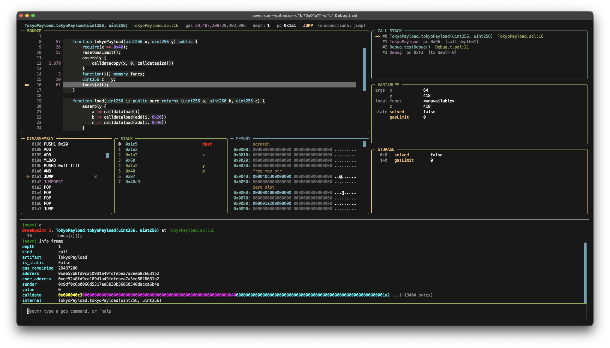

# sevm

`sevm` is an interactive EVM playground on Py-EVM, built for red-team dynamic analysis.

- **Full control**: Stepping through Solidity is only half of what this debugger does. Here you are `root` on the EVM, free to rewrite state, the stack, memory, storage, and gas while the transaction is still live.
- **Go low or high level**: Whether you are checking invariants with the source in hand, or dropping into raw EVM to build a jump-oriented programming (JOP) chain from a contract's bytecode, sevm handles both.
- **See everything**: No source, no problem. sevm maps every public function and the flow through it, wired into the decompiled output, so you can see what storage and memory changed at each step.
- **Foundry compatible**: Use Foundry cheatcodes while debugging.



**Table of Contents**
- [Install](#install)
- [Usage](#usage)
  - [Debug a Foundry test](#debug-a-foundry-test)
  - [Debug a web3.py script](#debug-a-web3py-script)
  - [Re-run with new calldata](#re-run-with-new-calldata)
  - [Set breakpoints](#set-breakpoints)
  - [Inspect the frame](#inspect-the-frame)
  - [Evaluate Solidity](#evaluate-solidity)
  - [Read local variables](#read-local-variables)
  - [Watch a storage variable](#watch-a-storage-variable)
  - [Change the running transaction](#change-the-running-transaction)
  - [Force an out-of-gas](#force-an-out-of-gas)
  - [Profile gas](#profile-gas)
  - [Debug a failing assertion](#debug-a-failing-assertion)
  - [Use Foundry cheatcodes](#use-foundry-cheatcodes)
  - [Run Yul at the prompt](#run-yul-at-the-prompt)
  - [Work without source](#work-without-source)
  - [Compile a project](#compile-a-project)
  - [Check the environment](#check-the-environment)
- [Reference](#reference)
- [Development](#development)
  - [Test](#test)

## Install

Clone the repository and install `sevm` as a global command:

```bash
git clone https://github.com/ChasmHQ/debugger && cd debugger

# if uv is not installed
pipx install uv

uv tool install .
```

sevm needs Python 3.10+ and `git`; it downloads solc itself, into `~/.solcx`, picking the
build for this machine — x86-64 and arm64 Linux, Intel and Apple silicon macOS, and
Windows are all covered, and a solc already installed by Foundry (`~/.svm`) or sitting on
`PATH` is used instead of a download. Anywhere else — musl systems like Alpine, NixOS,
an architecture Solidity does not publish for — sevm falls back to solc's WebAssembly
build, which needs `node` on PATH (or named by `SEVM_NODE`). Failing that, point sevm at a
compiler you have:

```bash
sevm compile --solc-binary /usr/bin/solc examples/bank/src
```

`SEVM_SOLC=/usr/bin/solc` does the same for every command.

## Usage

sevm has the following subcommands:
- `run`: debug a Foundry test, or a web3.py driver script.
- `compile`: compile the contracts and report what sevm sees.
- `doctor`: report the compiler, runtimes and caches sevm found on this machine.

For detailed information on each command and its options, run:

```bash
sevm -h
sevm <COMMAND> -h
```

By default `sevm run` opens the fullscreen interface in the screenshot above. The examples
below use `--console`, the plain-text frontend, but the commands are identical in both.

### Debug a Foundry test

Point `sevm run` at a `.sol` test and it runs without an existing Foundry project, even
when the file imports forge-std or other libraries. sevm resolves the imports, clones what
is missing, writes the remappings, and breaks on the first line of the test body:

```bash
$ sevm run --console -y examples/standalone/Vault.t.sol
standalone test at examples/standalone; compiling ...
installing forge-std from https://github.com/foundry-rs/forge-std @ v1.16.2
installing @openzeppelin/contracts from https://github.com/OpenZeppelin/openzeppelin-contracts @ v5.7.0
wrote 2 remapping(s) to remappings.txt
wrote 25 artifact(s) to out/sevm
debugging 1 test(s): VaultTest.testDeal
Breakpoint 1, VaultTest.testDeal() at Vault.t.sol:11
  11          vm.deal(alice, 3 ether);
```

Each test gets a fresh deploy, a `setUp()` and the test call, as forge isolates them. With
no filter, sevm debugs every test it discovers and `continue` runs to the next test body.
`-m/--match` narrows to test functions matching a substring, `--match-contract` to a
contract:

```bash
sevm run --console -m testDeposit examples/bank/test/Bank.t.sol
```

Inside a project with a `foundry.toml`, nothing is fetched. The project's `remappings.txt`,
`lib/`, solc pin and `evm_version` are used as they are.

### Debug a web3.py script

`sevm run` also takes a plain web3.py script, the kind that deploys and calls contracts
against an in-process Py-EVM chain. It runs unmodified: sevm compiles the contracts,
patches Py-EVM, runs the script on a worker thread, and stops the first time execution
enters code it recognises:

```bash
$ sevm run --console --contracts examples/bank/src examples/debug_bank.py
compiling examples/bank/src ...
cache hit (1 sources)
2 contract(s): Bank, Callee
bank : 0xF2E246BB76DF876Cef8b38ae84130F4F55De395b
alice: 0x2da044dB7416b5210C46b2dCdd521DBff696F3aa
Bank.deposit() at src/Bank.sol:51
  51      function deposit() public payable {
(sevm)
```

Recognition is by bytecode, not by instrumentation, which is why an unmodified script
works. Startup commands run before the prompt opens, so a session can land where you want
it:

```bash
sevm run -x 'b _credit' -x c --contracts examples/bank/src examples/debug_bank.py
```

### Re-run with new calldata

`reset` re-runs the target script from scratch — a fresh chain, with every breakpoint,
watchpoint and `display` still armed — and `run [ARGS]` re-runs it with new arguments.
For a script that takes its calldata as an argument, that is the whole iterate loop in
one session, without relaunching anything:

```bash
(sevm) b CALLDATACOPY
(sevm) c
Breakpoint 1, ...
pc 0x015c  CALLDATACOPY sp 1->7  gas 29,976,201  step 101
(sevm) run 0x000040c3...your next attempt...
(sevm) c                        # breakpoint survived the restart
```

Every stop ends with a one-line machine echo — pc, opcode, gas, step, and the stack
height as `old->new` whenever it changed (a `POP` reads `sp 13->12`) — so opcode-level
stepping always shows what the last instruction did to the machine.

Payload hex runs to thousands of characters, past what a Windows console or command line
will accept as one line, so an argument of the form `@path` is read from that file
instead, with whitespace stripped. It works at launch, at the prompt, and standalone:

```bash
sevm run ... script.py @C:/path/to/payload.hex   # at launch
(sevm) run @C:/path/to/payload.hex               # at the prompt
python script.py @payload.hex                    # without sevm at all
```

### Set breakpoints

Break on a function, a source line, a raw program counter, or on every occurrence of an
opcode in any contract:

```bash
(sevm) b _credit                 # a function, by name or Contract.name
(sevm) b Bank.sol:46             # a source line, snapped to the next line with code
(sevm) b *0x108                  # a raw program counter
(sevm) b SSTORE                  # every SSTORE, anywhere
(sevm) b Bank.sol:46 if amount > 1 ether
```

An opcode breakpoint is the way into code you have no line numbers for:

```bash
(sevm) b SSTORE
Breakpoint 1 on every SSTORE
(sevm) c
Breakpoint 1, Bank._credit(address, uint256) at src/Bank.sol:46
  46          balances[who] += amount - fee;
```

sevm also stops on reverts by default, at the failing instruction, and decodes the reason
as `reverted: "..."`, `panic 0x11`, or a custom error with its arguments.

### Inspect the frame

`info registers` is the machine at a glance:

```bash
(sevm) info registers
pc           0x09b5
opcode       PUSH0 (0x5f)
gas          278,719 remaining / 217 used of 278,936
depth        0
sp           5 items
address      0xf2e246bb76df876cef8b38ae84130f4f55de395b
code         0xf2e246bb76df876cef8b38ae84130f4f55de395b
msg.sender   0x2da044db7416b5210c46b2dcdd521dbff696f3aa
msg.value    2000000000000000000 (2 ether)
tx.origin    0x2da044db7416b5210c46b2dcdd521dbff696f3aa
static       no
step         582
```

`info storage` decodes the whole layout, packed slots and all, without you working out a
single slot number:

```bash
(sevm) info storage
Bank at 0xf2e246bb76df876cef8b38ae84130f4f55de395b
  slot   0+0  owner            address                = 0x7e5f4552091a69125d5dfcb7b8c2659029395bdf (cold)
  slot   0+20 feeBps           uint96                 = 25 (cold)
  slot   1+0  totalDeposits    uint256                = 1000000000000000000 (cold)
  slot   2+0  balances         mapping(address => uint256) = <mapping: query a key> (cold)
  slot   3+0  accounts         mapping(address => struct Bank.Account) = <mapping: query a key> (cold)
  slot   4+0  history          uint256[]              = [0 items] [] (cold)
  slot   5+0  name             string                 = "sevm-bank" (cold)
```

`bt` walks the call stack. Internal Solidity calls get their own frames even though the EVM
never changed depth:

```bash
(sevm) bt
-> #0 Bank._credit(address, uint256) at src/Bank.sol:45
   #1 Bank.deposit() at src/Bank.sol:52
   #2 Bank at pc 0x380
```

`l` lists source around the program counter, `disas` disassembles around it with the source
line each instruction belongs to, and `x/NFU` examines memory in gdb syntax:

```bash
(sevm) l
src/Bank.sol
 .   40      function _fee(uint256 amount) internal view returns (uint256) {
 .   41          return (amount * feeBps) / 10000;
     42      }
     43  
 .   44      function _credit(address who, uint256 amount) internal {
->   45          uint256 fee = _fee(amount);
 .   46          balances[who] += amount - fee;
 .   47          totalDeposits += amount - fee;
 .   48          history.push(amount);
     49      }
     50  
(sevm) disas
   09b3  JUMP L51
   09b4  JUMPDEST L44
=> 09b5  PUSH0 L45
   09b6  PUSH2 0x09be L45
   09b9  DUP3 L45
(sevm) x/32xb 0x80
0x0080: 00 00 00 00 00 00 00 00 00 00 00 00 00 00 00 00
0x0090: 00 00 00 00 00 00 00 00 00 00 00 00 00 00 00 00
(memory is 96 bytes; the rest reads as zero)
```

### Evaluate Solidity

`p` compiles the expression as real Solidity against the paused contract, runs it on a
state snapshot, and throws the snapshot away, so it cannot disturb the run:

```bash
(sevm) p balances[who] + 100 ether
$1 = 100000000000000000000 (100 ether)  (uint256)
(sevm) p keccak256(abi.encode(who, amount))
$2 = 0x7a26c77763128d91079351eafa8c68f983a19e3262ef0fcc7ac5a257c2253c3a  (bytes32)
(sevm) p type(uint256).max
$3 = 115792089237316195423570985008687907853269984665640564039457584007913129639935  (uint256)
```

Because it *is* Solidity, `internal` and `private` functions are callable too:

```bash
(sevm) p _fee(1 ether)
$4 = 2500000000000000 (0.002500 ether)  (uint256)
```

`p` discards its side effects. `call` keeps them:

```bash
(sevm) call setNickname("hodler")
done (gas 27599)
(sevm) p accounts[msg.sender].nickname
$5 = "hodler"  (string memory)
(sevm) call history.push(7)
done (gas 44484)
(sevm) p history.length
$6 = 1  (uint256)
```

`display` re-evaluates an expression at every stop, and `ptype` reports a type:

```bash
(sevm) display fee
1: fee = <EvalError: local `fee` cannot be used in an expression: this instruction allocates it; step once to
see it>
(sevm) n
Bank._credit(address, uint256) at src/Bank.sol:46
  46          balances[who] += amount - fee;
1: fee = 5000000000000000 (0.005000 ether)
(sevm) ptype balances[who]
type = uint256
```

### Read local variables

solc emits no location for locals, so sevm reconstructs them from the AST and the run's
stack heights. `info locals` names, types and decodes them:

```bash
(sevm) info locals
  who            address            = 0x2da044db7416b5210c46b2dcdd521dbff696f3aa (param)
  amount         uint256            = 2000000000000000000 (2 ether) (param)
  fee            uint256            = <unavailable>  this instruction allocates it; step once to see it
(sevm) n
Bank._credit(address, uint256) at src/Bank.sol:46
  46          balances[who] += amount - fee;
(sevm) p amount - fee
$1 = 1995000000000000000 (1.995000 ether)  (uint256)
```

A local that cannot be read says why rather than printing a wrong number.

### Watch a storage variable

A watchpoint breaks when a value changes, and reports the old and new values:

```bash
(sevm) watch totalDeposits
Watchpoint 2: totalDeposits (slot 0x1 of 0xf2e2..395b)
(sevm) c
Watchpoint 2 totalDeposits: 0xde0b6b3a7640000 -> 0x299060a1be4b8000
  Bank._credit(address, uint256) at src/Bank.sol:47
  47          totalDeposits += amount - fee;
```

Watchpoints work on state variables, on mapping elements (`watch balances[msg.sender]`) and
on memory (`watch *0x80`). `rwatch` breaks on reads and `awatch` on either.

### Change the running transaction

`set var` writes through Solidity, so mappings, packed slots and structs all encode
correctly. The write lands in the transaction that is still running, and it changes the
outcome:

```bash
(sevm) set var fee = 1 ether
fee = 1000000000000000000 (1 ether)
(sevm) set var balances[who] = 5 ether
balances[who] = 5000000000000000000 (5 ether)
(sevm) c
total deposits: 2000000000000000000
alice balance : 6000000000000000000
```

Without those two writes the same script prints `2995000000000000000` and
`1995000000000000000`.

The lower-level writes are there too:

```bash
(sevm) set $stack[0] = 0xc0ffee     # rewrite an operand before its opcode consumes it
(sevm) set $mem[0x80] = 1
(sevm) set $storage[0] = 0xdead
(sevm) jump 0x108                   # move the program counter, JUMPDESTs only
```

### Force an out-of-gas

Set the gas counter to whatever you need and let the transaction run into the wall:

```bash
(sevm) set $gas = 100
$gas = 100
(sevm) c
Stopped on error: OutOfGas: Out of gas: Needed 2100 - Remaining 67 - Reason: SLOAD
  Bank._fee(uint256) at src/Bank.sol:41
  41          return (amount * feeBps) / 10000;
```

The same stop is also the way **out** of an out-of-gas you did not plan: refill the
meter and continue, and the failed instruction is retried on its original stack —
the transaction then runs as if it had been sent with the larger limit:

```bash
(sevm) set $gas = 5000000
(sevm) c
```

The failure is real, not simulated. The script's own output shows the deposit never
happened:

```bash
total deposits: 1000000000000000000
alice balance : 0
```

### Profile gas

`info gas` breaks the spend down by source line and by opcode:

```bash
(sevm) info gas
limit        278,936
used         28,864
remaining    250,072
refund       0
this op      SSTORE base cost 0

gas by source line (highest first)
     20,262 L46   balances[who] += amount - fee;
      5,072 L47   totalDeposits += amount - fee;
      2,247 L41   return (amount * feeBps) / 10000;
        182 L7    contract Bank {
         25 L45   uint256 fee = _fee(amount);

gas by opcode
    107,200 SSTORE
      8,600 SLOAD
      1,046 CODECOPY
        624 JUMP
        339 PUSH2
```

### Debug a failing assertion

A failed forge-std assertion stops the debugger where it broke, with the comparison
decoded, and `up` walks back to your test:

```bash
$ sevm run --console -y -m testBalanceIgnoresFee examples/bank/test/FailingAssertion.t.sol
debugging 1 test(s): FailingAssertionTest.testBalanceIgnoresFee
Breakpoint 1, FailingAssertionTest.testBalanceIgnoresFee() at test/FailingAssertion.t.sol:18
  18          vm.prank(alice);
(sevm) c
Stopped on error: reverted: "assertion failed: 997500000000000000 != 1000000000000000000"
  StdAssertions.assertEq(uint256, uint256) at lib/forge-std/src/StdAssertions.sol:121
 121              vm.assertEq(left, right);
(sevm) up
#1  FailingAssertionTest.testBalanceIgnoresFee() at test/FailingAssertion.t.sol:20
```

This works because sevm implements the `vm.assert*` family as real comparisons, all 116
overloads that forge-std's own `assertEq` and friends call into.

### Use Foundry cheatcodes

Cheatcodes run against live Py-EVM state, both from inside the test and typed at the prompt
against the frame you are stopped in:

```bash
(sevm) vm.warp(12345)
vm.warp -> ok
(sevm) p block.timestamp
$1 = 12345  (uint256)
(sevm) vm.deal(alice, 5 ether)
vm.deal -> ok
(sevm) p alice.balance
$2 = 5000000000000000000 (5 ether)  (uint256)
(sevm) vm.prank(address(0xcafe))
vm.prank -> ok
```

An argument is either a literal (`12345`, `5 ether`, `0xcafe`, `true`, `"a string"`) or a
Solidity expression, so a local, a getter and a cast all work. A short hex value pads to an
address the way Solidity's own `address(0xcafe)` does. When nothing fits, the error names
the argument and keeps solc's reason:

```bash
(sevm) vm.prank(alcie)
error: vm.prank: argument 1 (alcie) is not a valid address (Undeclared identifier. Did you mean "alice"? (in
`alcie`))
```

Implemented: `warp roll fee chainId coinbase deal etch store load prank startPrank
stopPrank addr sign assume label`, plus the `vm.assert*` family. `console.log` prints as you
step.

Not yet supported: `expectRevert`, `expectEmit`, `expectCall`, `mockCall`, `ffi`, forking,
and fuzz or invariant argument generation.

### Run Yul at the prompt

Type a Yul builtin and it runs on the paused frame through Py-EVM's own opcode
implementations. This is the low-level twin of `set var`:

```bash
(sevm) mload(0x40)
mload(0x40) -> $1 = 0x80 (128)  (gas 3)
(sevm) sstore(3, add(sload(3), 1))
sstore(3, add(sload(3), 1)) -> ok  (gas 22,103)
(sevm) asm mstore(0x80, 1); mstore8(0xa0, 0x61); mload(0x80)
mstore(0x80, 1) -> ok  (gas 9)
mstore8(0xa0, 0x61) -> ok  (gas 6)
mload(0x80) -> $2 = 0x1 (1)  (gas 3)
```

Gas is metered, reported, and then handed back, so poking at the machine cannot turn a
transaction that succeeds into one that runs out of gas. Control-flow builtins and the
frame terminators are refused, with the reason:

```bash
(sevm) jump(0x10)
error: `jump`: Yul has no `jump`; use the debugger's `jump 0xPC` or `set $pc = 0xPC`
```

### Work without source

Convenience variables bypass solc, so they work on contracts you have no source for, and
they still mix into a Solidity expression:

```bash
(sevm) p $pc
$1 = 2497  (uint256)
(sevm) p $storage[1] + 1 ether
$2 = 2000000000000000000 (2 ether)  (uint256)
(sevm) p $stack[0]
$3 = 5000000000000000 (0.005000 ether)  (uint256)
(sevm) x/32xb $mem[0x40]
0x0080: 00 00 00 00 00 00 00 00 00 00 00 00 00 00 00 00
0x0090: 00 00 00 00 00 00 00 00 00 00 00 00 00 00 00 00
```

The full set is `$pc` `$gas` `$gasused` `$depth` `$sp` `$step` `$stack[N]` `$mem[0x40]`
`$storage[1]`, plus the value history `$1` `$2` and so on.

Selectors come out of the bytecode rather than the ABI, so a 4-byte value from a trace can
be traced to the pc it routes to even when nothing here declares it:

```bash
(sevm) sig transfer(address,uint256)
transfer(address,uint256)  0xa9059cbb  (hashed here; not in this ABI)
(sevm) info address 0xa9059cbb
selector     0xa9059cbb
the dispatcher never tests this selector: a call carrying it lands in the fallback
```

When the dispatcher does test it, `info address` reports the wrapper it jumps to and the
implementation's JUMPDEST behind it, which is the pc every caller converges on. See
[docs/commands.md](docs/commands.md#selectors-and-the-dispatcher).

### Compile a project

`sevm compile` runs the same build the debugger does and reports what it produced, which is
the fastest way to check whether a contract will be debuggable at all:

```bash
$ sevm compile examples/bank/src
cache hit (1 sources)
solc 0.8.36, optimizer off
  src/Bank.sol id=0 lines=99
  src/Bank.sol:Bank runtime=5302B source-map=yes state-vars=7 fns=15
  src/Bank.sol:Callee runtime=468B source-map=yes state-vars=1 fns=2
```

`source-map=NO` means stepping will not work for that contract. Builds are cached per
compilation unit, so an edit recompiles the file and its importers rather than the project:

```bash
$ cd examples/bank && time sevm compile .
wrote 27 artifact(s) to out/sevm
real  1.95

$ time sevm compile .
cache hit (22 sources)
real  0.53

$ time sevm compile .        # after editing one test
recompiled 1 of 22 sources
real  1.02
```

Artifacts land in `out/sevm/` in forge's layout, and the cache in `cache/sevm/`. Both are
cleared by `forge clean`. A directory with no `foundry.toml` gets nothing written into it.

### Check the environment

`sevm doctor` says which compiler this machine will use, where it came from, and what is
missing. It downloads nothing — a compiler that is not installed yet is reported as the
URL it would be fetched from:

```bash
$ sevm doctor
  sevm       0.1.0
  python     3.12.14 (CPython) at /home/fev/Projects/debugger/.venv/bin/python3
  platform   linux-arm64 (Linux aarch64, glibc 2.43)
  git        git version 2.55.0
  solc       0.8.28 at /home/fev/.solcx/solc-v0.8.28
  installed  0.8.36, 0.8.28
  available  68 releases, 0.5.0 .. 0.8.36
  wasm solc  /home/fev/.local/share/mise/installs/node/latest/bin/node v26.8.1
  binaries   /home/fev/.solcx
  cache      /home/fev/.cache/sevm
```

Anything that would stop sevm working is marked `!` and makes the command exit non-zero,
so it doubles as a CI check. `platform` is the build sevm downloads for; `available` is
what that platform publishes. Where nothing is published, `wasm solc` is what will run
instead, and an override from `SEVM_SOLC`, `SEVM_NODE` or `SOLCX_BINARY_PATH` is listed on
an `overrides` line so a stale environment variable cannot hide.

## Reference

| Guide | What is in it |
|---|---|
| [docs/commands.md](docs/commands.md) | every command, breakpoints and watchpoints, convenience variables |
| [docs/expressions.md](docs/expressions.md) | evaluating Solidity, reading and writing local variables |
| [docs/assembly.md](docs/assembly.md) | Yul builtins at the prompt, what is refused and why |
| [docs/foundry.md](docs/foundry.md) | projects, library install, the build cache, cheatcodes |

## Development

Set up an editable environment:

```bash
uv sync
uv run sevm --help
```

Format, lint, type-check, and build:

```bash
uv run ruff format src tests examples
uv run ruff check src tests examples
uv run mypy src
uv build
```

### Test

The suite runs under pytest and lives in `tests/`:

```bash
uv run pytest -q                                   
SEVM_NETWORK_TESTS=1 uv run pytest -q -m network   
```

## License

MIT. See [LICENSE](LICENSE).
