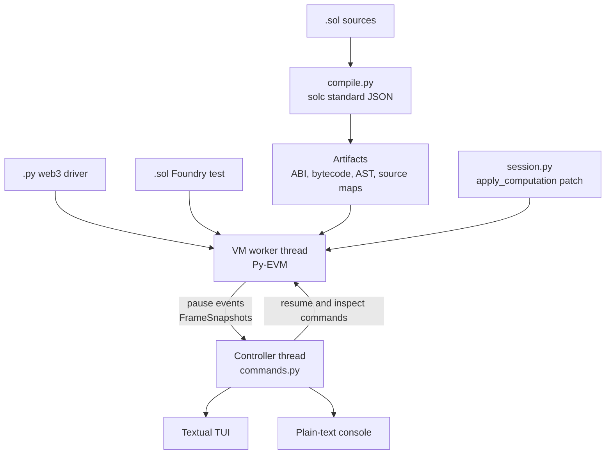

# sevm: a gdb-style Solidity debugger on Py-EVM

> **Note**: sevm is alpha software. Commands and debugger behavior may change.

> **Note**: Source-level stepping depends on unoptimized, non-via-IR builds. Optimized
> code degrades Solidity source maps and makes stepping unreliable.

A fullscreen, gdb-compatible interactive debugger for Solidity, running on Py-EVM. If
you know gdb, you know sevm: `b`, `n`, `s`, `si`, `finish`, `bt`, `p`, `x/32xb`,
`info registers`, and `set var` mean what you expect. The expressions are Solidity and
the machine underneath is the EVM.

sevm stops *inside* a running transaction with the frame still alive. You can read
uncommitted state, call view functions, rewrite a stack operand before the opcode consumes
it, and force an out-of-gas at an exact instruction.

<!-- demo: record the TUI (vhs/asciinema) and embed here -->

```text
+----------------------------------------------------------------------------+
| signature  File.sol:line   gas remaining/limit   depth   pc   mnemonic     |
+----------------------------------------------------------------------------+
| SOURCE                                          | CALL STACK               |
|                                                 |                          |
|                                                 +--------------------------+
|                                                 | VARIABLES                |
+------------------+--------------+--------------+--------------------------+
| DISASSEMBLY      | STACK        | MEMORY       | STORAGE                  |
|                  |              |              |                          |
+------------------+--------------+--------------+--------------------------+
| command log                                                                |
+----------------------------------------------------------------------------+
| (sevm)                                                                     |
+----------------------------------------------------------------------------+
```

## Quick Start

Install sevm from a checkout with [uv](https://docs.astral.sh/uv/):

```bash
uv tool install .
```

Run the example web3 driver in the fullscreen debugger, open the plain-text frontend, or
inspect the compiled contracts:

```bash
sevm run --contracts tests/contracts examples/debug_bank.py
sevm run --console --contracts tests/contracts examples/debug_bank.py
sevm compile tests/contracts
```

Options go **before** the target; everything after a `.py` target is forwarded to the
script. The first stop is usually the constructor. Use `-x c` to continue past it, or set
a breakpoint before continuing:

```bash
sevm run -x 'b Bank.sol:46' -x c --contracts tests/contracts examples/debug_bank.py
```

Run `sevm run --help` and `sevm compile --help` for the complete option list.

## Example: Debugging a Foundry Test

Point `sevm run` at a `.sol` test. A lone test can import forge-std and other libraries
without an existing Foundry project:

```solidity
// /tmp/scratch/Vault.t.sol
import {Test} from "forge-std/Test.sol";
import {IERC20} from "@openzeppelin/contracts/token/ERC20/IERC20.sol";

contract VaultTest is Test {
    address alice = address(0xA11CE);

    function testDeal() public {
        vm.deal(alice, 3 ether);
        assertEq(alice.balance, 3 ether);
    }
}
```

```console
$ sevm run --console -y /tmp/scratch/Vault.t.sol
standalone test at /tmp/scratch; compiling ...
installing forge-std from https://github.com/foundry-rs/forge-std @ v1.16.2
installing @openzeppelin/contracts from https://github.com/OpenZeppelin/openzeppelin-contracts @ v5.7.0
wrote 2 remapping(s) to remappings.txt
debugging 1 test(s): VaultTest.testDeal
Breakpoint 1, VaultTest.testDeal() at Vault.t.sol:11
  11          vm.deal(alice, 3 ether);
(sevm)
```

Each test gets a fresh deploy, `setUp()`, and test call. With no `-m/--match` filter,
`continue` runs to the next test body. Read [Foundry compatibility](#foundry-compatibility)
for supported workflows and cheatcodes.

## Example: Debugging a web3 Script

Your script needs no changes. It drives web3.py against an in-process Py-EVM chain while
sevm compiles the contracts, patches Py-EVM, and stops when execution enters recognized
bytecode:

```bash
sevm run --contracts tests/contracts examples/debug_bank.py
```

Start at the `Bank.deposit` breakpoint and skip the constructor stop with startup
commands:

```bash
sevm run -x 'b deposit' -x c --contracts tests/contracts examples/debug_bank.py
```

At the prompt, inspect or change the live transaction before the next opcode consumes
the frame:

```console
(sevm) p balances[msg.sender] + 100 ether
$1 = 101000000000000000000 (101 ether)  (uint256)
(sevm) set $gas = 100
```

## Features

- Stop inside a running transaction with the EVM frame and uncommitted state still live.
- Step by Solidity line or opcode, set conditional breakpoints, and watch storage or
  memory.
- Evaluate Solidity expressions, inspect locals and call frames, and decode reverts.
- Mutate storage, local variables, stack operands, memory, gas, and the program counter.
- Run Yul builtins against the paused frame through Py-EVM's opcode implementations.
- Debug Foundry tests with project discovery, library installation, build caching, and
  supported `vm.*` cheatcodes.
- Choose the Textual fullscreen interface or the plain-text console.

## Architecture



`session.py` monkeypatches `BaseComputation.apply_computation`, reimplementing Py-EVM's
opcode loop with a blocking hook. The debugged program runs on a worker thread; the
controller drives it over queues and the threads strictly alternate, so exactly one is
ever runnable. Only the VM thread touches Py-EVM objects. The controller gets immutable
`FrameSnapshot`s and asks for anything else through an inspect command that the VM thread
services while parked in the hook. Nested calls need no special handling because `CALL`
re-enters `apply_computation`. `state.snapshot()` and `state.revert()` provide journal
checkpoints for speculative execution.

| Module | Responsibility |
|---|---|
| `compile.py` | solc standard-JSON, the `Artifact` model, bytecode identity |
| `srcmap.py` | source map parsing, pc to line, internal jump markers |
| `disasm.py` | PUSH-aware disassembly, opcode table derived from Py-EVM |
| `frames.py` | EVM and internal frame model, AST function index, backtrace rows |
| `locals.py` | local-variable declarations, scope rules, stack-slot decoding |
| `breakpoints.py` | breakpoints and watchpoints, thread-safe |
| `session.py` | the patch, the stop policy, inspect and mutation operations |
| `evaluate.py` | Solidity expression evaluation by source injection |
| `decode.py` | storage layout decoding, calldata and revert decoding |
| `foundry.py` / `cheatcodes.py` | Foundry test driver / cheatcode interpreter |
| `libs.py` | import scanning, library lookup, clone, remapping |
| `commands.py` | the gdb command surface, shared by both frontends |
| `console.py` / `tui/` | plain-text and Textual frontends |
| `cli.py` | `sevm run` and `sevm compile` |

Read the [command reference](docs/commands.md),
[Solidity expression guide](docs/expressions.md), [Yul assembly guide](docs/assembly.md),
and [Foundry guide](docs/foundry.md) for the complete debugger surface.

## Use Cases

- Stop a failing Foundry test before its frame unwinds, then inspect the revert and state.
- Attach to an unchanged web3.py driver and debug deployment or transaction execution.
- Compare decoded Solidity values with raw stack, memory, storage, and calldata.
- Rewrite an operand or lower the remaining gas to reproduce a boundary condition at one
  instruction.
- Exercise a live frame with Solidity calls, Foundry cheatcodes, or Yul builtins.

## Foundry Compatibility

`sevm run` dispatches by extension: `.py` attaches to a web3 driver and `.sol` compiles
and runs a Foundry test. It honors `foundry.toml`, `remappings.txt`, installed libraries,
the configured solc version, and `evm_version`. A standalone `.t.sol` file can create a
minimal project and install missing imports after one prompt; `-y` accepts the write and
`--no-install` keeps the run disk-only.

The test runner isolates each test with a fresh deploy and `setUp()`. The cheatcode engine
implements state and environment mutations, pranks, signing helpers, console output, and
the 116 `vm.assert*` overloads used by forge-std. It does not yet support expectations,
mocking, FFI, forks, or fuzz and invariant argument generation.

Compilation uses a per-unit cache and writes forge-shaped artifacts under `out/sevm/`
without overwriting forge's optimizer-enabled output. Read the [Foundry tests,
dependencies, cache, and cheatcode reference](docs/foundry.md) for details.

## Requirements

Debug builds compile with the optimizer **off** and via-IR **off**. sevm warns if you
override that because optimized codegen degrades source maps and makes stepping
unreliable.

Transactions do **not** need an explicit `gas=`. `eth_estimateGas` binary-searches the
limit by running the transaction repeatedly, so its early probes fail out-of-gas by
design. sevm suspends the hook during those probes and reports how many it skipped in
`info frame`.

`git` must be on `PATH`: sevm clones missing libraries itself and never shells out to
`forge`. The first run for a library needs the network; later runs reuse the clone under
`lib/`. py-solc-x downloads solc on demand into `~/.solcx`, using the pragma-selected
version or the `foundry.toml` pin.

Verified with web3 7.16.0, py-evm 0.12.1b1, eth-tester 0.13.0b1, py-solc-x 2.0.5, solc
0.8.28, git 2.x, forge-std 1.16.2, Textual 8.2.8, and CPython 3.12. Python 3.10 or newer
is required.

## Development

Set up an editable development environment and install the command from the checkout:

```bash
uv sync
uv run sevm --help
uv tool install .
```

Run the local and network test suites:

```bash
uv run pytest -q                                   # 345 tests, no network
SEVM_NETWORK_TESTS=1 uv run pytest -q -m network   # 4 more, real forge-std and npm
```

The default run builds a forge-std fixture in `tmp_path`, so it needs no network. The
network tests install the real forge-std and OpenZeppelin repositories; one fails if
forge-std declares an assertion sevm does not implement.

Format, lint, type-check, and build the distribution:

```bash
uv run ruff format src tests examples
uv run ruff check src tests examples
uv run mypy src
uv build
```

## License

sevm is available under the [MIT License](LICENSE).
